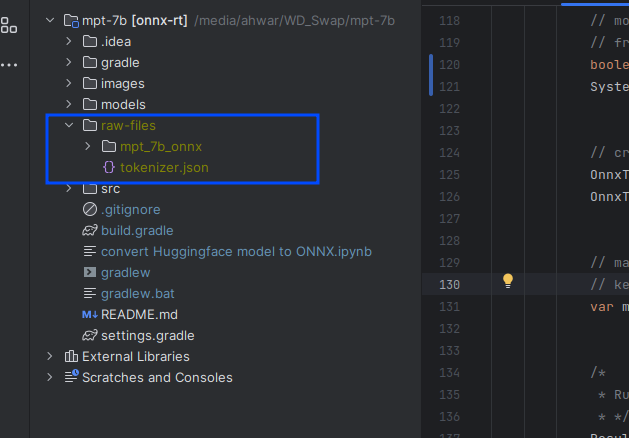
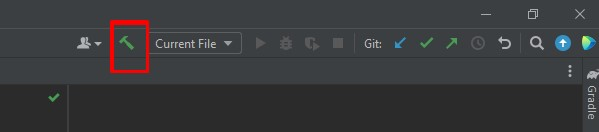
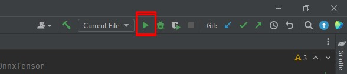

# Run HuggingFace NER (NLP) Model on Java using ONNX Runtime and DJL    
## Installation:
Open Project folder in Java IDE (`Recommended: IntelliJ IDEA Community`) with gradle support and Build the project

### Requirements:
1. Java Development Kit JDK version: 11
2. Gradle version 7+

### Download files

These files are required to run the project  

1. ONNX model 
2. `tokenizer.json` file

### Convert the ONNX model  

The model conversion which was already provided to you which is saved in file: `how to convert mpt-7b-model to onnx format.pdf` and after running that script your model was converted to onnx model and was saved in folder `mpt_7b_onnx`, you will have to move the that folder `mpt_7b_onnx` to `raw-files` in code current directory.

### Download tokenizer.json  
Tokenzer file `tokenizer.json` was taken from this [huggingface repo](https://huggingface.co/mosaicml/mpt-7b)  
Download the `tokenizer.json` from the [link](https://huggingface.co/mosaicml/mpt-7b/raw/main/tokenizer.json) 

**move files**  
Copy files created from above step into `raw-files` directory as shown in the below image  

## Building project
Build the project using This button

## Run the Code

Open the `Main.java` file and click the play button as shown in the red box in the below image  

